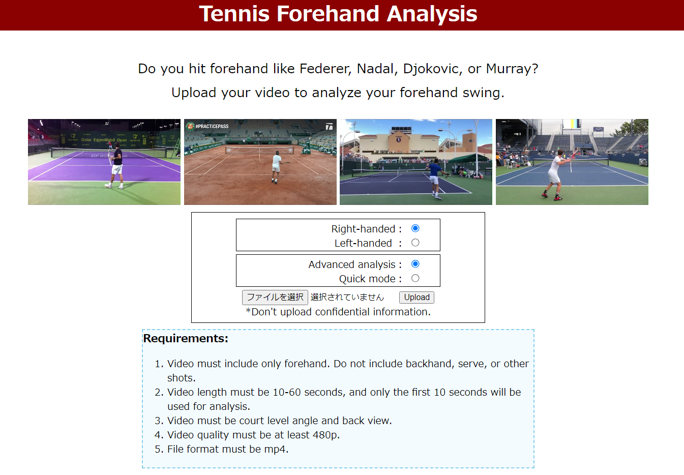
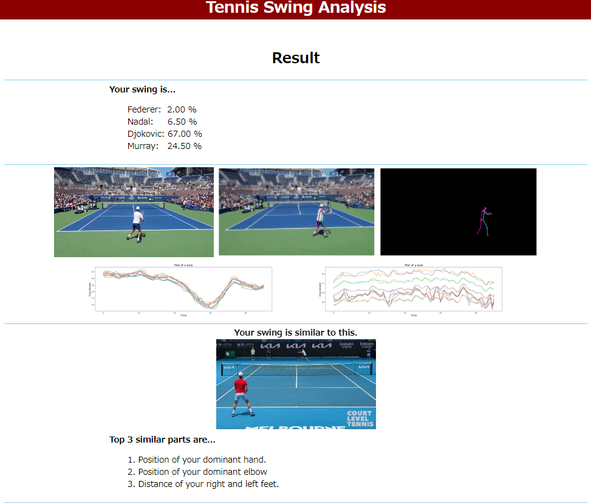
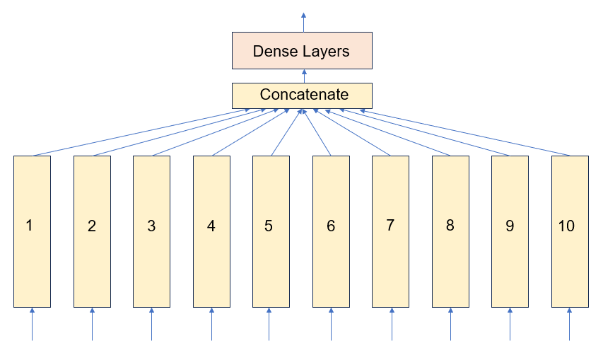
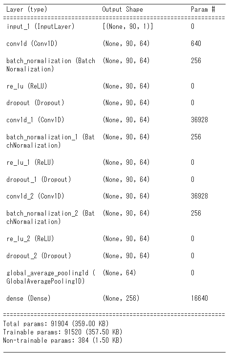

# tennis-swing-analysis

## About The Project

    
    

As a recreational tennis player, I've always wanted to hit beautiful shots like the best tennis players like Federer, Nadal, Djokovic, and Murray. To improve my game, I study their techniques on TV, trying to emulate their shots. I believe many tennis enthusiasts share this same passion.

There are a variety of play styles among the top professional tennis players. For example, Federer and Nadal have distinctly different forehand shots. If you can identify which player’s style is similar to yours, you can use them as a role model to improve your shots. This is the motivation behind this project.

In this project, I developed a model that analyzes videos of forehand shots, compares them to four professional players, and highlights similar features.

## Usage
The Flask web app is deployed on PythonAnywhere.
https://yuus.pythonanywhere.com/

1. Select whether you are right-handed or left-handed.
2. Select "Advanced analysis" or "Quick mode". "Advanced analysis" is recommended.
3. Select a file and upload.
4. Result page will be displayed after 1-3 minutes, so please wait.

## Pipeline
This model processes the input video with the following steps:
1. The uploaded video is checked to see if it meets the requirements.
2. Convert the video into GIF.
3. Run pose detection to detect the keypoints and edges of the body, using MoveNet.
4. My original model takes the outputs of MoveNet and predicts the similarity to four players.
5. Using the subparts of my model for feature extraction, identifies what makes it similar.
6. Display the results.

## Model
This project uses 2 models of deep neural network.
1. ModelNet is used to detect the key points and edges of the body in an input video. ModelNet detects 17 keypoints of a body such as "right elbow", "left knee", and "right hip". I referred to this tutorial, https://www.tensorflow.org/hub/tutorials/movenet

2. Model for swing analysis (original)
I developed a model to predict the similarity of the input compared to 4 players. It is also used for feature extraction to identify which features make it similar.

The model is composed of 10 sub-models, and each sub-model has the same structure shown on the right side. Each sub-model takes different inputs. The inputs are some features created by calculating distances between some keypoints detected by MoveNet. I named the features as: 
    1) left_wrist_up, 2) right_wrist_up, 3) right_elbow_distance, 4) right_arm_y, 5) left_arm_y, 6) wrist_y, 7) shoulder_y, 8) left_elbow_distance, 9) wrist_ankle_y, 10) ankle_open

    
    

## Training and Evaluation
The model is trained on videos on YouTube. The total duration of the training videos is 89 minutes, and the volume of the training data is expanded by taking different windows with strides. After expansion, the toral duration is 1,203 minutes.

I trained the model for 120 epochs, and then the validation loss converged.

The model is evaluated with cross-validation, and the accuracy is 93%.

## Future Work
### xxx
