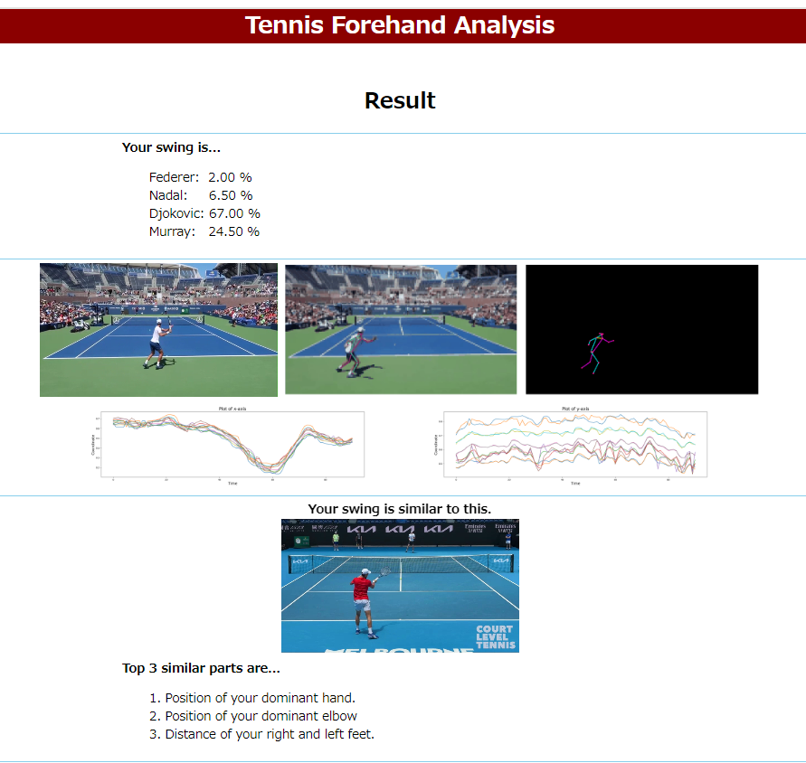

# tennis-swing-analysis

## About The Project

    
    

As a recreational tennis player, I've always wanted to hit beautiful shots like the best tennis players like Federer, Nadal, Djokovic, and Murray. To improve my game, I study their techniques on TV, trying to emulate their shots. I believe many tennis enthusiasts share this same passion.

There are a variety of play styles among the top professional tennis players. For example, Federer and Nadal have distinctly different forehand shots. If you can identify which player’s style is similar to yours, you can use them as a role model to improve your shots. This is the motivation behind this project.

In this project, I developed a model that analyzes videos of forehand shots, compares them to four professional players, and highlights the similar features.

## Usage
The Flask web app is deployed on PythonAnywhere.
https://yuus.pythonanywhere.com/

1. Select whether your are right-handed or left-handed.
2. Select "Advanced analysis" or "Quick mode". "Advanced analysis" is recommended.
3. Select a file and upload.
4. Result page will be displayed after 1-3 minutes, so please wait.

## Pipeline
This model process the input video with the following steps:
1. The upload video is checked if it meets the requirements.
2. Conver the video into GIF.
3. Run pose detection to detect the key points nad edges of the body, using MoveNet (https://www.tensorflow.org/hub/tutorials/movenet?hl=ja)
4. My original model takes the outputs of MoveNet and predicts the similarity to four players.
5. Using the subparts of my model for feature extraction, it identifies what makes it similar.
6. Display the results.

## Model

## Training and Evaluation

## Future Work
### xxx
